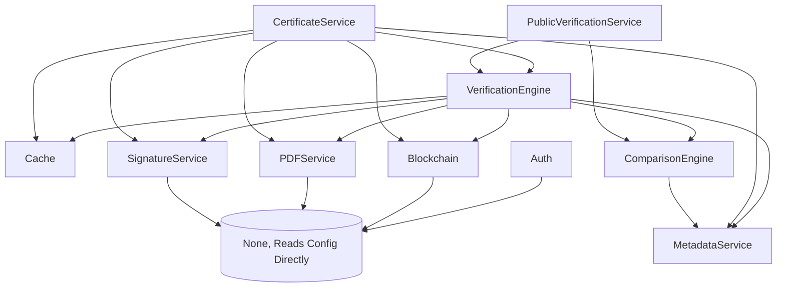

# Architecture & Design Reference

This document serves as the primary technical reference for the Certificate Verification System backend.

## System Overview

The backend is built in vanilla PHP (No Frameworks) requiring PHP 8.2+. It acts as the central orchestrator for issuing, storing, cryptographically signing, and resolving academic certificates anchored to an EVM-compatible blockchain. The primary interface is a RESTful API returning JSON, served directly by a unified routing file (`api/index.php`).

### The Two Certificate Flows

The system relies on a crucial distinction between two certificate issuance algorithms. Because PDF binary manipulation invalidates cryptographic hashes, both flows utilize an **`onchain_hash`** (a Keccak256 hash of both `metadata_hash` and `pdf_hash` BEFORE signing) as the stable cryptographic payload.

#### Flow 1: System-Generated (`/certificates/create`)
The backend is responsible for creating the PDF document.
- **PDFService:** Creates an HTML layout from `certificate_template.html`, injecting the university dataset and rendering a QR code image directly into the template. Calling `SetAdditionalXmpRdf()` during `mPDF` initialization ensures metadata is merged cleanly.
- **SignatureService:** The `onchain_hash` is computed from the pre-signed binary. The system signs the hash, not the binary, using the University's RSA private key. The signature is embedded inside the PDF's XMP block.

#### Flow 2: University Upload (`/certificates/upload`)
The backend receives a completely finished PDF generated externally.
- **PDFService:** Uses `smalot/pdfparser` to read visible text or extracts existing XMP payloads to retrieve the `certificate_id` and student references. `FPDI` is then used to graft/overlay a new QR code image into the bottom right corner of the first PDF page. A fresh XMP metadata standard payload (JSON) is forcibly string-replaced (`str_replace`) into the PDF binary before `%%EOF`. 
- **SignatureService:** Like Flow 1, the `onchain_hash` is computed, signed, and the signature block is appended into the XMP payload. 

---

## Module Breakdown

Every core file is located in the `src/` directory and is autoloaded via Composer's PSR-4 mapping (`App\`).

### `src/Auth.php`
- **Purpose**: Manages JWT authentication, password verification, and user session lookup.
- **Dependencies**: `Database.php`, `config.php`
- **Methods**:
  - `public function __construct()`
  - `public function login($email, $password)`
  - `public function register($data)`
  - `public function getUserById($id)`
  - `public function generateToken($user)`
  - `public function verifyToken($token)`
- **Notes**: JWT secret strictly relies on `config.php` returning the `$jwtSecret`. Falls back to nothing if missing.

### `src/Blockchain.php`
- **Purpose**: Handles Ethereum/Alchemy RPC JSON connections and Smart Contract transactions.
- **Dependencies**: `web3-php`, `kornrunner/ethereum-offline-raw-tx`, `config.php`
- **Methods**:
  - `public function __construct($strictMode = false)`
  - `public function isConnected(): bool`
  - `public function getConnectionStatus(): array`
  - `public function getCurrentBlock(): int`
  - `public function getAdmin(): string`
  - `public function verifyCertificate(string $certificateId, string $certificateHash): bool`
  - `public function generateCertificateHash($certificateData): string`
  - `public function generateKeccak256Hash(string $data): string`
  - `public function generateCombinedHash(string $metadataHash, string $pdfHash): string`
  - `public function issueCertificate($certificateData): array`
  - `public function getCertificate(string $certificateId): ?array`
  - `public function revokeCertificate(string $certificateId): array`
- **Notes**: `issueCertificate` uses raw transactions. If the blockchain is unavailable, the class smoothly degrades into `mock mode`, still issuing certificates locally. **Gotcha**: Pending transaction hashes are difficult to differentiate from fake mock hashes in testing.

### `src/Cache.php`
- **Purpose**: Singleton caching interface unifying Redis and File-based fallback storage.
- **Dependencies**: `predis/predis`, `config.php`
- **Methods**:
  - `public static function getInstance(): self`
  - `public function get(string $key, $default = null)`
  - `public function set(string $key, $value, int $ttl = null): bool`
  - `public function delete(string $key): bool`
  - `public function flush(): bool`
  - `public function remember(string $key, callable $callback, int $ttl = null)`

### `src/CertificateService.php`
- **Purpose**: Primary controller managing issuance and mutation of certificates. Orchestrates ID generation, database rows, PDF creation, signing, and anchoring.
- **Dependencies**: `Database.php`, `Blockchain.php`, `PDFService.php`, `SignatureService.php`, `MetadataService.php`, `VerificationEngine.php`
- **Methods**:
  - `public function __construct()`
  - `public function createCertificate($data)`
  - `public function uploadCertificate($uploadedFile, $universityId)`
  - `public function verifyCertificate($certificateId, $certificateHash = null)`
  - `public function verifyUploadedPDF($uploadedFile)`
  - `public function updateCertificate(string $certificateId, array $updateData, int $universityId): array`
  - `public function deleteCertificate(string $certificateId): array`
  - `public function listCertificates(array $filters = [], int $page = 1, int $perPage = 20): array`
  - `public function getCertificate($certificateId)`
  - `public function revokeCertificate($certificateId, $revokedBy)`
  - `public function getStudentCertificates($studentId)`
- **Notes**: 
  - Updates to a certificate (via `updateCertificate`) update the database row and invalidate the cache but **DO NOT** re-anchor on the blockchain.
  - `createCertificate()` now returns a `blockchain_mode` field (`'live'` or `'mock'`) natively to indicate anchoring status.

### `src/ComparisonEngine.php`
- **Purpose**: Compares extracted PDF structures to the canonical database rows.
- **Dependencies**: `Database.php`, `MetadataService.php`, `PDFService.php`
- **Methods**:
  - `public function __construct()`
  - `public function comparePDFWithDatabase(string $pdfPath, string $certificateId): array`

### `src/Database.php`
- **Purpose**: Singleton wrapper returning native PHP PDO object.
- **Dependencies**: `config.php`
- **Methods**:
  - `public static function getInstance()`
  - `public function getConnection()`
  - `public function __clone()`
  - `public function __wakeup()`

### `src/MetadataService.php`
- **Purpose**: Reconciles and formats JSON metadata strictly to standard schema bounds. Handles Keccak hashing for metadata.
- **Dependencies**: `kornrunner/keccak`
- **Methods**:
  - `public function buildMetadata(array $data): array`
  - `public function normalizeMetadata(array $metadata): array`
  - `public function generateMetadataJson(array $metadata): string`
  - `public function generateMetadataHash(array $metadata): string`
  - `public function extractMetadata(string $jsonString): ?array`
  - `public function compareMetadata(array $metadata1, array $metadata2): array`
  - `public function getSchemaVersion(): string`

### `src/PDFService.php`
- **Purpose**: Creates, modifies, and extracts embedded data from PDF files.
- **Dependencies**: `Database.php`, `MetadataService.php`, `mPDF`, `FPDI`, `smalot/pdfparser`, `endroid/qr-code`
- **Methods**:
  - `public function __construct()`
  - `public function generateCertificatePDF(string $certificateId, array $certificateData): string`
  - `public function embedMetadata(string $pdfPath, array $metadata): bool`
  - `public function getPDFPath(string $certificateId): ?string`
  - `public function extractMetadata(string $pdfPath): ?array`
  - `public function extractText(string $pdfPath): string`
  - `public function calculatePDFHash(string $pdfPath): string`
  - `public function insertQRCode(string $pdfPath, string $qrCodePath, array $position = ['x' => 150, 'y' => 20]): bool`
  - `public function generateQRCodeFileName(string $certificateId): ?string`
  - `public function embedMetadataIntoPDF(string $pdfPath, array $metadata): bool`
  - `public function addQRCodeToExistingPDF(string $pdfPath, string $certificateId): bool`
- **Notes**: `mPDF` cannot load HTTP endpoints — all images like QR code files must exist securely on the local disk absolute pathway first. `embedMetadata()` is left as an empty stub for compatibility, `generateCertificatePDF` embeds via `SetAdditionalXmpRdf()` instead.

### `src/PublicVerificationService.php`
- **Purpose**: Wrapper aggregating tests across VerificationEngine and ComparisonEngine for the untrusted unified verification portal.
- **Dependencies**: `Database.php`, `VerificationEngine.php`, `ComparisonEngine.php`, `PDFService.php`
- **Methods**:
  - `public function __construct()`
  - `public function verifyPublic(?string $certificateId = null, ?array $uploadedFile = null): array`
  - `public function getStoredCertificatePDF(string $certificateId): ?array`

### `src/SignatureService.php`
- **Purpose**: OpenSSL adapter for public/private key-pair cryptography used on issued PDFs.
- **Dependencies**: `Database.php`, OpenSSL PHP Extension, `config.php`
- **Methods**:
  - `public function __construct()`
  - `public function signPDF(string $pdfPath, int $universityId, string $onchainHash): bool`
  - `public function verifySignature(string $pdfPath, string $onchainHash): array`
  - `public function generateUniversityKeyPair(int $universityId, string $universityName): ?array`
- **Notes**: 
  - Signs the stable `onchainHash` string, NOT the PDF binary.
  - `0x` prefix is stripped via `ltrim()` before `hex2bin()` in both `signPDF()` and `verifySignature()`.
  - `verifySignature()` requires `$onchainHash` as a mandatory second parameter — it is not optional.
  - Private keys stored in DB (`university_keys.certificate_password`) are encrypted with AES-256-CBC using `KEY_ENCRYPTION_SECRET` from config.
  - Legacy plain base64 keys are still supported with auto-detection and a warning log.
  - `generateUniversityKeyPair()` also writes `.pem` files to the `certs/` directory as a backup but the DB column is the primary source used at signing time.

### `src/VerificationEngine.php`
- **Purpose**: Carries out the 8-step process checking DB existence, signature validities, metadata matching, and execution of blockchain validations and logic logging algorithms.
- **Dependencies**: `Database.php`, `Blockchain.php`, `PDFService.php`, `SignatureService.php`, `MetadataService.php`, `ComparisonEngine.php`, `Cache.php`
- **Methods**:
  - `public function __construct()`
  - `public function verifyUploadedPDF(string $pdfPath): array`
  - `public function verifyByCertificateId(string $certificateId, ?string $providedHash = null): array`
  - `public function invalidateBlockchainCache(string $certificateId, ?string $onchainHash = null): void`

---

## Full API Surface

| Endpoint | Method | Auth Req. | Roles | Controller / Method |
| :--- | :---: | :---: | :---: | :--- |
| `/auth/login` | POST | No | N/A | `Auth::login()` |
| `/auth/register` | POST | No | N/A | `Auth::register()` |
| `/certificates/create` | POST | Yes | `university`, `admin` | `CertificateService::createCertificate()` |
| `/certificates/upload` | POST | Yes | `university`, `admin` | `CertificateService::uploadCertificate()` |
| `/certificates/verify` | POST | Yes* | *Ignored by default, used internally | `CertificateService::verifyUploadedPDF()` OR `verifyCertificate()` |
| `/public/verify` | GET/POST | No | N/A | `PublicVerificationService::verifyPublic()` |
| `/public/certificate/download`| GET | No | N/A | `PublicVerificationService::getStoredCertificatePDF()` |
| `/certificates` | GET | Yes | `student`, `admin`, `university` | Direct query in `index.php` -> DB |
| `/certificates/revoke` | POST | Yes | `admin`, `university` | `CertificateService::revokeCertificate()` |
| `/certificates/download` | GET | Yes | Any | `PDFService::getPDFPath()` & Output |
| `/universities` | GET/POST | GET (No) POST (Yes)| `admin` (POST)| Direct DB query / insert |
| `/students` | GET/POST | Yes | `university`, `admin` | DB Query / Auth Register and student creation |
| `/certificates/get` | GET | No | N/A | `CertificateService::getCertificate()` |
| `/certificates/update` | PUT/POST | Yes | `university`, `admin` | `CertificateService::updateCertificate()` |
| `/certificates/delete` | POST/DEL | Yes | `admin` | `CertificateService::deleteCertificate()` |
| `/certificates/list` | GET | Yes | `university`, `admin` | `CertificateService::listCertificates()` |
| `/universities/generate-key` | POST | Yes | `admin` | `SignatureService::generateUniversityKeyPair()` |

---

## Dependency Map

---

## Database Schema (certificate_db)

### `universities`
- `id` (INT)
- `name` (VARCHAR)
- `code` (VARCHAR)
- `address` (TEXT)
- `contact_email` (VARCHAR)
- `contact_phone` (VARCHAR)
- `wallet_address` (VARCHAR)
- `signing_cert_path` (VARCHAR)
- `signing_cert_password_encrypted` (VARCHAR)
- `is_active` (BOOLEAN)

### `users`
- `id` (INT)
- `username` (VARCHAR)
- `email` (VARCHAR)
- `password_hash` (VARCHAR)
- `role` (ENUM: `admin`, `university`, `student`)
- `full_name` (VARCHAR)
- `university_id` (INT) - FK
- `wallet_address` (VARCHAR)

### `students`
- `id` (INT)
- `user_id` (INT) - FK
- `student_id` (VARCHAR)
- `university_id` (INT) - FK
- `date_of_birth` (DATE)
- `enrollment_date` (DATE)

### `certificates`
- `id` (INT)
- `certificate_id` (VARCHAR)
- `student_id` (INT) - FK
- `university_id` (INT) - FK
- `course_name` (VARCHAR)
- `degree_type` (VARCHAR)
- `issue_date` (DATE)
- `certificate_hash` (VARCHAR)
- `blockchain_tx_hash` (VARCHAR)
- `pdf_path` (VARCHAR)
- `qr_code_path` (VARCHAR)
- `status` (ENUM: `active`, `revoked`, `expired`)
- `revoked_at` (TIMESTAMP)
- `revoked_by` (INT) - FK
- `metadata_hash` (VARCHAR)
- `pdf_hash` (VARCHAR)
- `onchain_hash` (VARCHAR)
- `signature_status` (BOOLEAN)
- `metadata_json` (JSON)
- `block_number` (BIGINT)
- `chain_id` (INT)
- `schema_version` (VARCHAR)
- `is_revoked` (BOOLEAN)

### `verification_logs`
- `id` (INT)
- `certificate_ref_id` (INT) - FK
- `certificate_id` (VARCHAR)
- `verifier_ip` (VARCHAR)
- `verification_method` (ENUM)
- `verification_result` (ENUM)
- `verification_details` (JSON)

### `university_keys`
- `id` (INT)
- `university_id` (INT) - FK
- `certificate_path` (VARCHAR)
- `certificate_password` (VARCHAR) - Stores AES Encrypted private key
- `public_key_pem` (TEXT)
- `key_fingerprint` (VARCHAR)

---

## Cache Key Reference

| Key Pattern | Stores | Writes | TTL | Purpose |
| :--- | :--- | :--- | :--- | :--- |
| `verify:{certificateId}` | Full Verification Object | `VerificationEngine::verifyUploadedPDF()`, `verifyByCertificateId` | `3600` | Heavy cached comparison metrics |
| `cert_light:{certificateId}` | Light Verification Object | `VerificationEngine::quickVerifyByCertificateId()`, `CertificateService::warmupCertificateCache()` | `3600` | Rapid resolution for repeated queries |
| `blockchain_verify:{certificateId}:{onchainHash}` | `true/null` | `VerificationEngine::verifyBlockchainCached()`, `CertificateService::warmupCertificateCache()` | `300` / `3600` | TTL is 300s when written by `VerificationEngine::verifyBlockchainCached()`, but is overwritten with `cache.ttl` (default 3600s) when `CertificateService::warmupCertificateCache()` runs after certificate creation. Last write wins. This is a known inconsistency. |

*Invalidation Notes*: When updating, deleting, or revoking a certificate via `CertificateService`, `verify:{id}` and `cert_light:{id}` are actively decimated. `blockchain_verify:*` is only removed upon `revocation` explicitly via `VerificationEngine::invalidateBlockchainCache`.

---

## Known Issues (Discovered in Codebase)

1. **`PDFService::embedMetadata()` is a stub**: The method effectively returns `true` and ignores inputs. The actual rendering path has been moved strictly to `mPDF` injections via `generateCertificatePDF()`.
2. **Transaction Mode Masking**: `Blockchain.php:issueCertificate` uses `$this->isConnected` flag. If a local connection drops, or keys are invalid, it quietly issues mock success hashes that look identical to database writes, severely delaying debug times for network failures.
3. **CORS Regex Weakness**: `api/index.php` contains a regex `^https?://(localhost|127\.0\.0\.1)(:\d+)?$` handling all localized CORS requests blindly.
4. **Blockchain Sync Invalidation Gap**: Pattern-based deletion (`blockchain_verify:{id}:*`) in cache resets implies a globbing interface, but Redis cache execution only passes explicit explicit scalar keys, breaking the `CertificateService::revokeCertificate` ability to clear all instances reliably without the specific `onchainHash`.
5. **Cache TTL Conflict**: `blockchain_verify` cache TTL conflict between `VerificationEngine` (300s) and `CertificateService::warmupCertificateCache()` (uses `cache.ttl`, default 3600s).
6. **KEY_ENCRYPTION_SECRET Config Wiring**: `KEY_ENCRYPTION_SECRET` is not in `config.php` — `SignatureService` reads `$this->config['signing']['key_encryption_secret']` which will always be null until this key is added manually to the signing config block.
7. **Signer Warning Ignored**: `signPDF()` failure is non-fatal — if signing fails, `createCertificate()` logs a warning and continues. Certificates can be stored with `signature_status = 0` silently.
8. **Update Synchronization**: `updateCertificate()` updates the DB row and regenerates the PDF but does NOT re-anchor on the blockchain. The original `onchain_hash` and `blockchain_tx_hash` remain unchanged in the DB even after an update.
