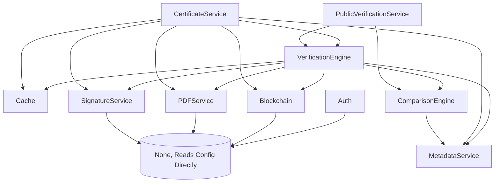

# Architecture & Design Reference

This document serves as the primary technical reference for the Certificate Verification System backend.

## System Overview

The backend is built in vanilla PHP (No Frameworks) requiring PHP 8.2+. It acts as the central orchestrator for issuing, storing, cryptographically signing, and resolving academic certificates anchored to an EVM-compatible blockchain. The primary interface is a RESTful API returning JSON, served directly by a unified routing file (`api/index.php`).

### The Two Certificate Flows

The system relies on a crucial distinction between two certificate issuance algorithms. Because PDF binary manipulation invalidates cryptographic hashes, both flows utilize an **`onchain_hash`** (a Keccak256 hash of both `metadata_hash` and `pdf_hash` BEFORE signing) as the stable cryptographic payload.

#### Flow 1: System-Generated (`/certificates/create`)
The backend is responsible for creating the PDF document.
- **PDFService:** Creates an HTML layout from `certificate_template.html`, injecting the university dataset and rendering a QR code image directly into the template. Calling `SetAdditionalXmpRdf()` during `mPDF` initialization ensures metadata is merged cleanly.
- **SignatureService:** The `onchain_hash` is computed from the pre-signed binary. The system signs the hash, not the binary, using the University's RSA private key. The signature is embedded inside the PDF's XMP block.

#### Flow 2: University Upload (`/certificates/upload`)
The backend receives a completely finished PDF generated externally.
- **PDFService:** Uses `smalot/pdfparser` to read visible text or extracts existing XMP payloads to retrieve the `certificate_id` and student references. `FPDI` is then used to graft/overlay a new QR code image into the bottom right corner of the first PDF page. A fresh XMP metadata standard payload (JSON) is forcibly string-replaced (`str_replace`) into the PDF binary before `%%EOF`. 
- **SignatureService:** Like Flow 1, the `onchain_hash` is computed, signed, and the signature block is appended into the XMP payload. 

---

## Module Breakdown

Every core file is located in the `src/` directory and is autoloaded via Composer's PSR-4 mapping (`App\`).

### `src/Auth.php`
- **Purpose**: Manages JWT authentication, password verification, and user session lookup.
- **Dependencies**: `Database.php`, `config.php`
- **Methods**:
  - `public function __construct()`
  - `public function login($email, $password)`
  - `public function register($data)`
  - `public function getUserById($id)`
  - `public function generateToken($user)`
  - `public function verifyToken($token)`
- **Notes**: JWT secret strictly relies on `config.php` returning the `$jwtSecret`. Falls back to nothing if missing.

### `src/Blockchain.php`
- **Purpose**: Ethereum/Alchemy RPC JSON-RPC integration for smart contract interactions. Handles certificate issuance anchoring and verification queries on Ethereum Sepolia testnet.
- **Dependencies**: `web3-php`, `kornrunner/ethereum-offline-raw-tx`, `config.php`
- **Methods**:
  - `public function __construct($strictMode = false)` - Initialize HttpProvider connection to RPC endpoint; set strictMode to throw exceptions instead of returning false
  - `public function isConnected(): bool` - Check if RPC connection is alive
  - `public function getConnectionStatus(): array` - Detailed status object {connected, rpc_url, contract_address, ...}
  - `public function getCurrentBlock(): int` - Get latest block number from blockchain (0 in mock mode)
  - `public function getAdmin(): string` - Call contract.admin() public method
  - `public function verifyCertificate(string $certificateId, string $certificateHash): bool` - Call contract.verifyCertificate() to check if certificate is anchored; returns true/false
  - `public function generateKeccak256Hash(string $data): string` - Generate Keccak256 hash via kornrunner library
  - `public function generateCombinedHash(string $metadataHash, string $pdfHash): string` - Compute onchain_hash = keccak256(metadataHash + pdfHash)
  - `public function issueCertificate(array $certificateData): array` - **Synchronous** contract call to anchor certificate; returns {success, tx_hash, blockchain_mode}
  - `public function getCertificate(string $certificateId): ?array` - Query contract for certificate data
  - `public function revokeCertificate(string $certificateId): array` - Call contract.revokeCertificate()
- **Network Configuration**:
  - Network: **Ethereum Sepolia Testnet** (ChainID 11155111)
  - Provider: Alchemy RPC https://eth-sepolia.g.alchemy.com/v2/{API_KEY}
  - Private key: Used to sign raw transactions (paid with testnet ETH)
- **Synchronous Anchoring**:
  - Certificate issuance (`/certificates/create`, `/certificates/upload`) **blocks** until blockchain call completes
  - If blockchain is unavailable or transaction fails, system gracefully downgrades to **mock mode** (success response with `blockchain_mode: 'mock'`, `mock: true`)
  - DB stores actual tx_hash if live, or mock hash if offline
  - Certificate is stored in DB regardless of blockchain status (local fallback works)
- **Mock Mode**: When blockchain unavailable, generates deterministic mock tx_hash (`0xmock_`) and continues. Verification falls back to local signature/hash checks. This ensures **zero downtime**.
- **Graceful Failure**: No background jobs, no retry queue. If RPC endpoint fails, continues with mock hash. Verification logic handles both live and mock hashes transparently.

### `src/Cache.php`
- **Purpose**: Singleton caching interface unifying Redis and File-based fallback storage.
- **Dependencies**: `predis/predis`, `config.php`
- **Methods**:
  - `public static function getInstance(): self`
  - `public function get(string $key, $default = null)`
  - `public function set(string $key, $value, int $ttl = null): bool`
  - `public function delete(string $key): bool`
  - `public function flush(): bool`
  - `public function remember(string $key, callable $callback, int $ttl = null)`

### `src/CertificateService.php`
- **Purpose**: Primary controller managing issuance and mutation of certificates. Orchestrates ID generation, database rows, PDF creation, signing, and anchoring.
- **Dependencies**: `Database.php`, `Blockchain.php`, `PDFService.php`, `SignatureService.php`, `MetadataService.php`, `VerificationEngine.php`
- **Methods**:
  - `public function __construct()`
  - `public function createCertificate($data)`
  - `public function uploadCertificate($uploadedFile, $universityId)`
  - `public function verifyCertificate($certificateId, $certificateHash = null)`
  - `public function verifyUploadedPDF($uploadedFile)`
  - `public function updateCertificate(string $certificateId, array $updateData, int $universityId): array`
  - `public function deleteCertificate(string $certificateId): array`
  - `public function listCertificates(array $filters = [], int $page = 1, int $perPage = 20): array`
  - `public function getCertificate($certificateId)`
  - `public function revokeCertificate($certificateId, $revokedBy)`
  - `public function getStudentCertificates($studentId)`
- **Notes**: 
  - Updates to a certificate (via `updateCertificate`) update the database row and invalidate the cache but **DO NOT** re-anchor on the blockchain.
  - `createCertificate()` now returns a `blockchain_mode` field (`'live'` or `'mock'`) natively to indicate anchoring status.

### `src/ComparisonEngine.php`
- **Purpose**: Compares extracted PDF structures to the canonical database rows.
- **Dependencies**: `Database.php`, `MetadataService.php`, `PDFService.php`
- **Methods**:
  - `public function __construct()`
  - `public function comparePDFWithDatabase(string $pdfPath, string $certificateId): array`

### `src/Database.php`
- **Purpose**: Singleton wrapper returning native PHP PDO object.
- **Dependencies**: `config.php`
- **Methods**:
  - `public static function getInstance()`
  - `public function getConnection()`
  - `public function __clone()`
  - `public function __wakeup()`

### `src/MetadataService.php`
- **Purpose**: Reconciles and formats JSON metadata strictly to standard schema bounds. Handles Keccak hashing for metadata.
- **Dependencies**: `kornrunner/keccak`
- **Methods**:
  - `public function buildMetadata(array $data): array`
  - `public function normalizeMetadata(array $metadata): array`
  - `public function generateMetadataJson(array $metadata): string`
  - `public function generateMetadataHash(array $metadata): string`
  - `public function extractMetadata(string $jsonString): ?array`
  - `public function compareMetadata(array $metadata1, array $metadata2): array`
  - `public function getSchemaVersion(): string`

### `src/PDFService.php`
- **Purpose**: Creates, modifies, and extracts embedded data from PDF files.
- **Dependencies**: `Database.php`, `MetadataService.php`, `mPDF`, `FPDI`, `smalot/pdfparser`, `endroid/qr-code`
- **Methods**:
  - `public function __construct()`
  - `public function generateCertificatePDF(string $certificateId, array $certificateData): string`
  - `public function embedMetadata(string $pdfPath, array $metadata): bool`
  - `public function getPDFPath(string $certificateId): ?string`
  - `public function extractMetadata(string $pdfPath): ?array`
  - `public function extractText(string $pdfPath): string`
  - `public function calculatePDFHash(string $pdfPath): string`
  - `public function insertQRCode(string $pdfPath, string $qrCodePath, array $position = ['x' => 150, 'y' => 20]): bool`
  - `public function generateQRCodeFileName(string $certificateId): ?string`
  - `public function embedMetadataIntoPDF(string $pdfPath, array $metadata): bool`
  - `public function addQRCodeToExistingPDF(string $pdfPath, string $certificateId): bool`
- **Notes**: `mPDF` cannot load HTTP endpoints — all images like QR code files must exist securely on the local disk absolute pathway first. `embedMetadata()` is left as an empty stub for compatibility, `generateCertificatePDF` embeds via `SetAdditionalXmpRdf()` instead.

### `src/PublicVerificationService.php`
- **Purpose**: Wrapper aggregating tests across VerificationEngine and ComparisonEngine for the untrusted unified verification portal.
- **Dependencies**: `Database.php`, `VerificationEngine.php`, `ComparisonEngine.php`, `PDFService.php`
- **Methods**:
  - `public function __construct()`
  - `public function verifyPublic(?string $certificateId = null, ?array $uploadedFile = null): array`
  - `public function getStoredCertificatePDF(string $certificateId): ?array`

### `src/SignatureService.php`
- **Purpose**: OpenSSL adapter for RSA 2048 key-pair cryptography. Generates university-specific signing keys, creates cryptographic signatures on certificate hashes, and verifies signatures during verification workflow.
- **Dependencies**: `Database.php`, OpenSSL PHP Extension, `config.php`
- **Methods**:
  - `public function __construct()`
  - `public function signPDF(string $pdfPath, int $universityId, string $onchainHash): bool` - Sign the onchain_hash with university's private key, embed in PDF XMP
  - `public function verifySignature(string $pdfPath, string $onchainHash): array` - Extract signature from PDF XMP, validate against onchain_hash using stored public key
  - `public function generateUniversityKeyPair(int $universityId, string $universityName): ?array` - Create RSA 2048 key pair, store encrypted private key in DB, backup .pem files to certs/ directory
  - `public function getUniversityPrivateKey(int $universityId): ?string` - Retrieve and decrypt private key from database
  - `public function embedSignatureInXMP(string $pdfPath, string $signatureB64, string $fingerprint): bool` - Inject signature data into PDF's XMP metadata packet
  - `public function extractSignatureFromXMP(string $pdfPath): ?array` - Parse XMP to extract embedded signature and metadata
  - `public function getPublicKeyByFingerprint(string $fingerprint): ?string` - Lookup public key from university_keys table
- **Key Implementation Notes**: 
  - Signs the stable `onchainHash` string (Keccak256 composite hash), NOT the PDF binary.
  - `0x` prefix is stripped via `ltrim()` before `hex2bin()` in both signing and verification.
  - `verifySignature()` requires `$onchainHash` as a mandatory parameter.
  - Private keys are encrypted with **AES-256-CBC** using `KEY_ENCRYPTION_SECRET` from config (`signing.key_encryption_secret`).
  - Legacy plain base64 keys auto-detected with warning log for backward compatibility.
  - Each university has one active key pair; `generateUniversityKeyPair()` also backs up `.pem` files but DB is the source of truth.

### `src/StudentService.php`
- **Purpose**: CRUD operations for students with authorization checks and scoped queries.
- **Dependencies**: `Database.php`, `config.php`
- **Methods**:
  - `public function getStudentById(int $id, bool $includeInactive = false): ?array` - Fetch student with users table join (returns name, email, enrollment_date)
  - `public function updateStudent(int $studentId, array $data): array` - Update full_name (via users table) or date_of_birth (students table)
  - `public function softDeleteStudent(int $studentId): array` - Set is_active = FALSE (soft delete)
  - `public function getStudentCertificates(int $studentId, array $filters = [], int $page = 1, int $limit = 20): array` - Paginated certificate list with status/course_name filters
  - `public function checkStudentAuthorization(int $userId, int $studentId, string $action, string $callerRole, ?int $callerUniversityId): bool` - RBAC logic: admin=all students, student=self-only, university=same-university students
- **Authorization Rules**:
  - `admin` role: access all students
  - `student` role: access only own record (userId == studentId user)
  - `university` role: access only students from same university (callerUniversityId == student.university_id)

### `src/UniversityService.php`
- **Purpose**: University management, statistics aggregation, and authorization.
- **Dependencies**: `Database.php`, `config.php`
- **Methods**:
  - `public function getUniversity(int $id, bool $includeInactive = false): ?array` - Fetch university record (active-only by default)
  - `public function updateUniversity(int $id, array $data): array` - Update name, address, contact_email, contact_phone
  - `public function deactivateUniversity(int $id): array` - Soft delete (set is_active = FALSE)
  - `public function getUniversityStudents(int $universityId, array $filters = [], int $page = 1, int $limit = 20): array` - List students with enrollment_date range, is_active filters, pagination
  - `public function getUniversityCertificates(int $universityId, array $filters = [], int $page = 1, int $limit = 20): array` - List certificates with status, course_name, issue_date range filters
  - `public function getUniversityStats(int $universityId): array` - Aggregate statistics: total_students, active_students, total_certificates, certificates_by_status, average_verification_time
  - `public function checkUniversityAuthorization(int $universityId, string $action, string $callerRole, ?int $callerUniversityId): bool` - RBAC: admin=all universities, university=self-only
- **Feature**: Statistics aggregation provides dashboard metrics for universities and admins

### `src/EmailService.php`
- **Purpose**: Email sending via SMTP (tested with Gmail). Used for password reset notifications.
- **Dependencies**: `PHPMailer`, `config.php`
- **Methods**:
  - `public function sendPasswordResetEmail(string $email, string $resetToken, int $expiryTime): bool` - Send HTML-formatted reset link email with token and expiry info
  - `public function sendEmail(string $to, string $subject, string $body, string $altBody = ''): bool` - Generic email sender with plain-text fallback
- **Configuration**:
  - SMTP host, port, encryption (TLS/SSL) loaded from config
  - From address and sender name customizable
  - **Blocking**: Email sends synchronously (no queue)
- **Gmail Setup**: Use App Passwords (not account password) for MAIL_PASSWORD config

### `src/FileService.php`
- **Purpose**: File validation and storage for user avatars.
- **Dependencies**: `config.php`
- **Methods**:
  - `public function validateImageFile(array $file): array` - Validate MIME type (JPG/PNG), file size (2MB max), return {valid, error}
  - `public function uploadAvatar(int $userId, array $file): array` - Save avatar to storage/avatars/, delete old avatar if exists, return {success, path}
  - `public function deleteOldAvatar(int $userId): bool` - Cleanup previous avatar before upload
- **Storage**: Files stored on disk at `storage/avatars/` with user ID in filename
- **Validation**: MIME whitelist (JPG, PNG), 2MB size limit

### `src/VerificationEngine.php`
- **Purpose**: Implements the complete 8-step certificate verification pipeline with intelligent caching. Handles both PDF uploads and certificate ID lookups.
- **Dependencies**: `Database.php`, `Blockchain.php`, `PDFService.php`, `SignatureService.php`, `MetadataService.php`, `ComparisonEngine.php`, `Cache.php`
- **Methods**:
  - `public function verifyUploadedPDF(string $pdfPath): array` - Full verification for uploaded PDF files (8 steps, no cache to prevent accepting tampered files with stale results)
  - `public function verifyByCertificateId(string $certificateId, ?string $providedHash = null): array` - Lightweight verification by ID with caching; if hash provided, performs full comparison
  - `private function quickVerifyByCertificateId(string $certificateId): array` - Fast lookup with lighter DB query (cached)
  - `private function verifyBlockchainCached(string $certificateId, string $onchainHash): bool` - Call blockchain verification with 5-minute cache (caches only true results; failures bypass cache for retry)
  - `private function getCertificateRecord(string $certificateId): ?array` - Fetch with joined students/users/universities tables
  - `private function sanitizeDbRecord(array $record): array` - Remove sensitive fields (password hashes, key paths) before returning
  - `private function logVerification(string $certificateId, string $status, string $method, array $result): void` - Write audit entry to verification_logs table
  - `private function parseMetadataFromText(string $text): ?array` - Fallback text parsing if XMP extraction fails
  - `public function invalidateBlockchainCache(string $certificateId, ?string $onchainHash = null): void` - Explicitly clear cached blockchain verification (used on revocation)
- **The 8-Step Verification Process** (verifyUploadedPDF):
  1. **Extract Metadata**: Parse PDF XMP metadata to extract certificate_id and certificate data
  2. **Database Lookup**: Query DB for certificate record; fail if not found
  3. **Revocation Check**: Verify certificate is not revoked (status != 'revoked')
  4. **Signature Verification**: Extract signature from PDF XMP, verify against onchainHash using university's public key
  5. **Metadata Comparison**: Compare extracted metadata with database record (via ComparisonEngine)
  6. **Hash Validation**: Verify PDF hash matches stored hash
  7. **Blockchain Verification** (cached, 5-min TTL): Query smart contract to verify certificate is anchored; gracefully degrade if blockchain unavailable
  8. **Generate Report**: Compile all checks into comprehensive result object
- **Caching Strategy**:
  - `verifyByCertificateId()`: Full result cached 1 hour (key: `verify:{certificateId}`)
  - `quickVerifyByCertificateId()`: Light result cached 1 hour (key: `cert_light:{certificateId}`)
  - `verifyBlockchainCached()`: Only caches successful verifications, 5-minute TTL (key: `blockchain_verify:{certificateId}:{onchainHash}`)
  - `verifyUploadedPDF()`: NO CACHING (prevents stale results for tampered PDFs)
- **Fail-Safe Design**: If blockchain unavailable during verification, continues with local verification (signature + hash checks) and reports blockchain status

---

## Full API Surface

| Endpoint | Method | Auth | Roles | Parameters | Controller |
|:---|:---:|:---:|:---|:---|:---|
| `/auth/login` | POST | No | N/A | email, password | Auth::login() |
| `/auth/register` | POST | No | N/A | email, password, username, full_name, role | Auth::register() |
| `/auth/university/register` | POST | No | N/A | university_name, university_email, university_phone, university_address, admin_name, admin_email, admin_password | Auth::register() (university flow) |
| `/auth/university/login` | POST | No | N/A | email, password | Auth::login() (university only) |
| `/auth/verify-token` | POST | No | N/A | token (in body) | Auth::verifyToken() |
| `/auth/profile` | GET | Yes | Any | - | Auth::getUserById() |
| `/auth/profile` | PUT | Yes | Any | username, full_name | Auth::updateProfile() |
| `/auth/change-password` | POST | Yes | Any | current_password, new_password | Auth::changePassword() |
| `/auth/forgot-password` | POST | No | N/A | email | Auth::createPasswordResetToken() |
| `/auth/reset-password` | POST | No | N/A | token, new_password | Auth::resetPassword() |
| `/auth/profile/avatar` | PUT | Yes | Any | file: avatar (multipart) | FileService::uploadAvatar() |
| `/certificates/create` | POST | Yes | university, admin | student_id, course_name, degree_type, issue_date, university_id | CertificateService::createCertificate() |
| `/certificates/upload` | POST | Yes | university, admin | file: certificate (PDF) | CertificateService::uploadCertificate() |
| `/certificates/verify` | POST | Yes* | *Auth optional, used internally | certificate_id **OR** file: certificate (PDF) | CertificateService::verifyCertificate() or verifyUploadedPDF() |
| `/certificates` | GET | Yes | student, admin, university | - | ListCertificates (scoped by role) |
| `/certificates/:id` | GET | Yes | Any | - | CertificateService::getCertificate() (scoped) |
| `/certificates/revoke` | POST | Yes | admin, university | certificate_id | CertificateService::revokeCertificate() |
| `/certificates/download` | GET | Yes | Any | certificate_id, token (query) | PDFService::getPDFPath() → PDF binary |
| `/certificates/get` | GET | No | N/A | certificate_id (query) | CertificateService::getCertificate() (public) |
| `/certificates/update` | PUT/POST | Yes | university, admin | certificate_id, updated fields | CertificateService::updateCertificate() |
| `/certificates/delete` | DELETE/POST | Yes | admin | certificate_id | CertificateService::deleteCertificate() |
| `/certificates/list` | GET | Yes | university, admin | page, per_page, university_id, student_id, status, course_name | CertificateService::listCertificates() |
| `/students` | GET | Yes | university, admin | - | StudentService::getStudents() (scoped) |
| `/students` | POST | Yes | university, admin | username, email, password, full_name, student_id, enrollment_date, university_id | Auth::register() (student flow) |
| `/students/:id` | GET | Yes | Any | - | StudentService::getStudentById() (scoped) |
| `/students/:id` | PUT | Yes | admin, self | full_name, date_of_birth | StudentService::updateStudent() |
| `/students/:id` | DELETE | Yes | admin | - | StudentService::softDeleteStudent() |
| `/students/:id/certificates` | GET | Yes | Any | status, course_name, issue_date_from, issue_date_to, sort, order, page, limit | StudentService::getStudentCertificates() |
| `/universities` | GET | No | N/A | - | UniversityService::getUniversity() (active only) |
| `/universities` | POST | Yes | admin | name, code, address, contact_email, contact_phone | UniversityService::createUniversity() |
| `/universities/:id` | GET | No | N/A | - | UniversityService::getUniversity() (active only) |
| `/universities/:id` | PUT | Yes | admin, university | name, address, contact_email, contact_phone | UniversityService::updateUniversity() |
| `/universities/:id` | DELETE | Yes | admin | - | UniversityService::deactivateUniversity() |
| `/universities/:id/students` | GET | Yes | admin, university | enrollment_date_from, enrollment_date_to, sort, order, page, limit, is_active | UniversityService::getUniversityStudents() |
| `/universities/:id/certificates` | GET | Yes | admin, university | status, course_name, issue_date_from, issue_date_to, sort, order, page, limit | UniversityService::getUniversityCertificates() |
| `/universities/:id/stats` | GET | Yes | admin, university | - | UniversityService::getUniversityStats() |
| `/universities/generate-key` | POST | Yes | admin | university_id | SignatureService::generateUniversityKeyPair() |
| `/public/verify` | GET/POST | No | N/A | certificate_id (query/body) **OR** file: certificate | PublicVerificationService::verifyPublic() |
| `/public/certificate/download` | GET | No | N/A | certificate_id (query), view (optional) | PublicVerificationService::getStoredCertificatePDF() |
| `/debug/headers` | GET | No | N/A | - | Debugging endpoint (dev only) |

---

## Dependency Map

---

## Database Schema (certificate_db)

### `universities`
- `id` (INT, PK)
- `name` (VARCHAR, 255)
- `code` (VARCHAR, 50, UNIQUE)
- `address` (TEXT)
- `contact_email` (VARCHAR, 255)
- `contact_phone` (VARCHAR, 20)
- `wallet_address` (VARCHAR, 255, NULLABLE)
- `signing_cert_path` (VARCHAR, 255, NULLABLE)
- `signing_cert_password_encrypted` (VARCHAR, 255, NULLABLE)
- `is_active` (BOOLEAN, default 1)
- `created_at` (TIMESTAMP)
- `updated_at` (TIMESTAMP)

### `users`
- `id` (INT, PK)
- `username` (VARCHAR, 255, UNIQUE)
- `email` (VARCHAR, 255, UNIQUE)
- `password_hash` (VARCHAR, 255)
- `role` (ENUM: `admin`, `university`, `student`)
- `full_name` (VARCHAR, 255)
- `avatar_path` (VARCHAR, 255, NULLABLE)
- `university_id` (INT, FK → universities.id, NULLABLE)
- `wallet_address` (VARCHAR, 255, NULLABLE)
- `created_at` (TIMESTAMP)
- `updated_at` (TIMESTAMP)

### `students`
- `id` (INT, PK)
- `user_id` (INT, FK → users.id)
- `student_id` (VARCHAR, 255, UNIQUE)
- `university_id` (INT, FK → universities.id)
- `date_of_birth` (DATE, NULLABLE)
- `enrollment_date` (DATE)
- `is_active` (BOOLEAN, default 1)
- `created_at` (TIMESTAMP)
- `updated_at` (TIMESTAMP)

### `certificates`
- `id` (INT)
- `certificate_id` (VARCHAR)
- `student_id` (INT) - FK
- `university_id` (INT) - FK
- `course_name` (VARCHAR)
- `degree_type` (VARCHAR)
- `issue_date` (DATE)
- `certificate_hash` (VARCHAR, 255)
- `blockchain_tx_hash` (VARCHAR, 255, NULLABLE)
- `blockchain_status` (ENUM: `pending`, `submitted`, `anchored`, `failed`, `mock`, default `anchored`)
- `blockchain_submitted_at` (TIMESTAMP, NULLABLE)
- `blockchain_anchored_at` (TIMESTAMP, NULLABLE)
- `blockchain_attempts` (INT, default 0)
- `blockchain_error` (TEXT, NULLABLE)
- `pdf_path` (VARCHAR, 255)
- `qr_code_path` (VARCHAR, 255, NULLABLE)
- `status` (ENUM: `active`, `revoked`, `expired`, default `active`)
- `revoked_at` (TIMESTAMP, NULLABLE)
- `revoked_by` (INT, FK → users.id, NULLABLE)
- `metadata_hash` (VARCHAR, 255)
- `pdf_hash` (VARCHAR, 255)
- `onchain_hash` (VARCHAR, 255)
- `signature_status` (BOOLEAN, default 0)
- `metadata_json` (JSON)
- `block_number` (BIGINT, NULLABLE)
- `chain_id` (INT)
- `schema_version` (VARCHAR, 10, default '1.0')
- `is_revoked` (BOOLEAN, default 0)
- `created_at` (TIMESTAMP)
- `updated_at` (TIMESTAMP)
- **Indexes**: `idx_blockchain_status(blockchain_status, blockchain_attempts, created_at)`

### `verification_logs`
- `id` (INT, PK)
- `certificate_ref_id` (INT, FK → certificates.id, NULLABLE)
- `certificate_id` (VARCHAR, 255)
- `verifier_ip` (VARCHAR, 45)
- `verification_method` (ENUM: `certificate_id`, `hash`, `qr_code`, `pdf_upload`, `signature`)
- `verification_result` (ENUM: `valid`, `invalid`, `revoked`, `not_found`)
- `verification_details` (JSON)
- `verified_at` (TIMESTAMP)

### `university_keys`
- `id` (INT, PK)
- `university_id` (INT, FK → universities.id, UNIQUE)
- `certificate_path` (VARCHAR, 255, NULLABLE)
- `certificate_password` (TEXT, AES-256-CBC encrypted)
- `public_key_pem` (TEXT)
- `key_fingerprint` (VARCHAR, 255)
- `is_active` (BOOLEAN, default 1)
- `created_at` (TIMESTAMP)
- `updated_at` (TIMESTAMP)

### `password_resets`
- `id` (INT, PK)
- `user_id` (INT, FK → users.id)
- `token` (VARCHAR, 255, SHA256 hashed)
- `expires_at` (TIMESTAMP, 15-minute TTL from creation)
- `created_at` (TIMESTAMP)

---

## Cache Key Reference

| Key Pattern | Stored Value | Written By | TTL | Purpose | Invalidation |
|:---|:---|:---|:---:|:---|:---|
| `verify:{certificateId}` | Full verification result object (signature, hash, comparison, blockchain status) | `VerificationEngine::verifyByCertificateId()` | 3600s | Heavy cached verification metrics for ID-based lookups | When certificate updated/revoked/deleted |
| `cert_light:{certificateId}` | Lightweight verification object (basic status only) | `VerificationEngine::quickVerifyByCertificateId()` | 3600s | Rapid resolution for repeated quick lookups | When certificate updated/revoked/deleted |
| `blockchain_verify:{certificateId}:{onchainHash}` | Boolean (true) or null | `VerificationEngine::verifyBlockchainCached()` | 300s (5 min) | Blockchain RPC query result (caches only true; failures bypass) | When certificate revoked; otherwise expires naturally |

**Important Caching Behavior:**
- **`verify:*` and `cert_light:*`**: Active invalidation on certificate updates/deletions via `CertificateService` methods
- **`blockchain_verify:*`**: Only caches successful (true) results. Failures NOT cached—re-queried on next verification attempt
- **PDF Upload Verification**: NO CACHING—each uploaded PDF is freshly verified to prevent accepting tampered files with stale results
- **Cache Backend**: Redis if available, file-based fallback in `storage/cache/`
- **TTL Conflict Note**: `CertificateService::warmupCertificateCache()` may overwrite `blockchain_verify` TTL with `cache.ttl` (default 3600s), causing stale blockchain results for up to 1 hour

---

## Known Issues (Current Implementation)

1. **`PDFService::embedMetadata()` is a stub**: The method returns `true` and ignores inputs. Metadata embedding now happens exclusively during PDF generation via `mPDF`'s `SetAdditionalXmpRdf()` in `generateCertificatePDF()`.

2. **Mock Mode Hashes**: `Blockchain::issueCertificate()` uses `$this->isConnected` flag. If blockchain is unavailable or transaction fails, it silently generates mock hashes that look identical to real hashes (e.g., `0xmock_...`). This can delay debugging—check `blockchain_mode` field in response to distinguish live from mock anchoring.

3. **KEY_ENCRYPTION_SECRET Not Auto-Wired**: The `KEY_ENCRYPTION_SECRET` config value is not automatically loaded into `$config['signing']['key_encryption_secret']`. It must be manually added to the `'signing'` section of `config.php` or signature encryption will fail silently.

4. **Cache TTL Conflict**: `blockchain_verify` cache has inconsistent TTL: VerificationEngine uses 300s (5 minutes), but `CertificateService::warmupCertificateCache()` overwrites with `cache.ttl` (default 3600s). Last write wins. This can cause stale blockchain verification results for up to 1 hour after certificate creation.

5. **Pattern-Based Cache Invalidation**: `CertificateService::revokeCertificate()` attempts to clear `blockchain_verify:{id}:*` patterns, but Redis/file cache implementation only supports explicit scalar keys. Pattern-based glob deletion is **not** working—full cache invalidation may be needed.

6. **Signer Warnings Are Non-Fatal**: `SignatureService::signPDF()` failure logs a warning but doesn't abort. Certificates are stored with `signature_status = 0` if signing fails. Verification will fail downstream, but issuance succeeds. Consider making signature failures fatal if `REQUIRE_SIGNATURE = true`.

7. **Update Certificate -> No Blockchain Re-Anchor**: `CertificateService::updateCertificate()` updates the DB row and regenerates the PDF but **does NOT** re-anchor to blockchain. Original `onchain_hash`, `blockchain_tx_hash`, and `block_number` remain unchanged. The new PDF is signed with the same old `onchain_hash`—signature may fail if PDF content changed significantly.

8. **No Async Blockchain Anchoring**: Blockchain anchoring is **fully synchronous**. All certificate creation blocks until blockchain call completes (or timeout). No background jobs update blockchain status after creation. If you need true async, a separate polling job and message queue must be added separately.
